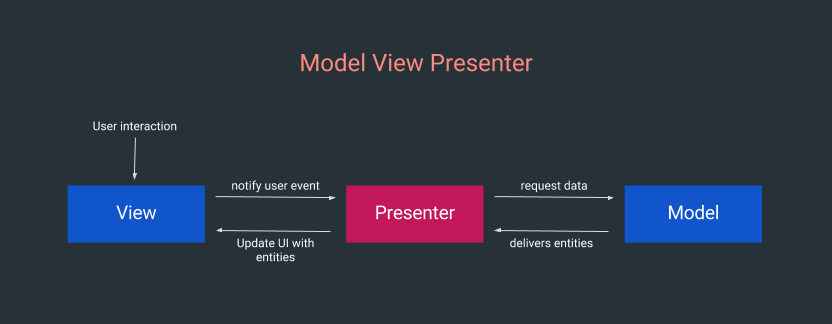
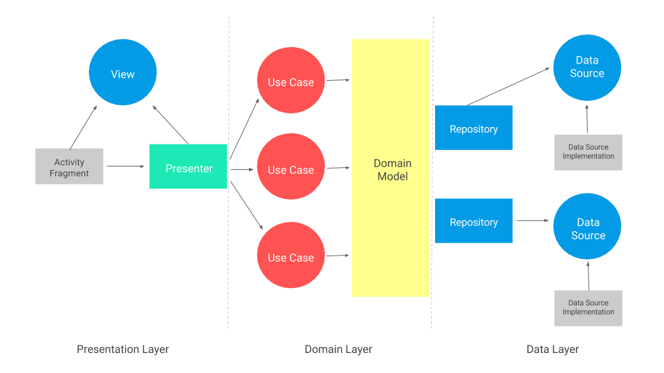

# Tarea.

## Arquitectura Model View Presenter y como se diferencia del Model View Controller.

Model view controller (MVC) es un patrón que permite desacoplar la implementación de las vistas de la implementación lógica de negocio de nuestro modelo.

En éste patrón hay tres componentes importantes: Modelo, Vista y controlador.
El modelo es el encargado de encapsular y mantener la lógica de negocio lo que tiene que hacer nuestra aplicación.
La vista es la encargada de renderizar los layouts creados en xml.
La función del controlador es intercambiar mensajes entre la vista y el modelo, típicamente se utiliza una subclase de Activity, Fragment y un service como controlador.

Una mala aplicación de MVC comienza cuando decidimos usar un activity o un fragment como un controlador, ya que las actividades y fragmentos forman parte de la vista dentro de MVC.

Es por ello que se introduce el MVP que es un patrón derivado de MVC comúnmente usado en la construcción de interfaces gráficas, que debemos considerar y tener en mente es que el MVP no es un patrón de arquitectura, es decir sólo se encarga de implementar la lógica de la capa de presentación.



* M: El modelo es el proveedor de datos que queremos en la vista.
* V: Una view dentro de MVP no representa una vista del SDK de android (Android class View), es decir no es un TextView, ni un button ni un layout. Una view representa una abstracción de lo que se puede hacer con la vista, normalmente se asocia a una interface para representar la funcionalidad de una vista. La parte importante está en una Activity o un fragmento tienen la responsabilidad únicamente de implementar la interface View y conectar las acciones del ususario con el presenter.

* Presenter: En este patrón	 es el encargafo de coordinar la implementación de la vista y el modelo, actualiza la vista y actúa sobre los eventos de un usuario que se envían por la vista. El presenter también recupera los datos del modelo y los prepara para su visualización.

## Investigar más a detalle la arquitectura CLEAN.

La arquitectura Clean fue propuesta por Robert Cecil Martin (El tío Bob) y es algo de lo que se ha hablado bastante en los últimos años dentro de la comunidad de Android.
Surge con la problemática de que en un framework se encuentra más código que lo representa, en lugar del problema que está resolviendo, es decir, la idea es centrarse en lo que tiene que hacer la aplicación como tal y es por ello que dice que debemos de pensar en él framework como el mecanismo de paso de mensajes hacia nuestro software, el cual se debe mirar como una herramienta o plugin de lo que queremos realizar.

El tío Bob menciona que más que una arquitectura, es una serie de reglas que se deben cumplir para que una arquitectura sea considerada "clean".

Tiene la siguiente estructura.


Lo único que nos dice es que hay que respetar la regla de dependencia "Dependency rule." que establece que "El código fuente sólo puede apuntar hacia adentro".

##### Entities (Entidades).

Son aquellos objetos que van a representar los actores importantes de la lógica de negocio de nuestra aplicación.

##### Use cases (Casos de uso).

Están muy relacionados con las entidades y son los encargados de implementar lógica de negocio de nuestra aplicación, ya que van a orientar todas aquellas interacciones del flujo de datos y entidades dejando al framework fuera de todo esto (En nuestro caso el sdk android), también  se conocen como interactores.

##### Interface adapters (Adaptdores de interfaz).

Convierten los datos en el formato más conveniente para los casos de uso y entidades. 

##### Frameworks and drivers.
Aquí es donde residen los detalles y todo ese conjunto de plataformas externas y herramientas como puede ser la UI, Web, DB, dispositivos, etc. generalmente sólo se deben comunicar con el siguiente círculo a su interior


El siguiente esquema es una representación de cómo se aplica el clean architecture en una aplicación android, ya que gracias a la gran participación de muchos desarrolladores de la comunidad alrededor del mundo se ha ido mejorando en estos últimos meses ya que se le han agregado dos componentes importantes, el primero un patrón en la capa de preentación que puede ser MVP, MVVM, MVC o el que se desee, y el segundo se ha agreado el repositorio "pattern" en la capa de datos para abstraer el origen de datos y destacar que estos patrones no están dentro de la arquitectura que Uncle Bob describe, es un trabajo de una comunidad con el único objetivo de mejorar el desarrollo de las aplicaciones android.



#####Presentation layer.
Es la capa en donde ocurre todo lo relacionado a como funcionan las vistas normalmente activities y fragmentos los cuales contienen lógica pero úniamente enfocada en cómo funciona la vista, es decir el que debo mostrarle al usuario y cuando debe hacerlo. Para lograr un mejor manejo de vistas en esta capa se suelen usar patrones de UI.

#####Domain Layer.
Toda lógica de negocio ocurre en esta capa, aquí solo lo enfocado a que tiene que hacer la aplicación. Se encuentran entidades y casos de uso regularmente es sólo código Java y no hay ninguna dependencia de Android.

#####Data layer.
Es la capa en donde se obtienen todos los datos que necesita nuestra aplicación para funcionar y los datos pueden ser de proveídos por una base de datos, de la red o de la memoria o de donde nos imaginemos particularmente en android hacemis uso de Repository Pattern, un patrón que permite abstraer el origen de datos en donde no va a importar de dónde vengan, lo más importante es que serán obtenidos de algún lugar y podemos utilizarlos para hacer que las acciones que tengamos que hacer.

## Investigar la biblioteca EventBus y como esta nos ayuda a comunicarnos dentro de nuestra aplicación.
EventBus es una biblioteca optimizada para android de publicación/evento, simplifica la comunicación entre componentes:
* Desacopla eventos "senders" y "recievers".
* Funciona bien con actividades, fragmentos y fondos hilados (backgound trheads).
* Evita dependencias complejas y propensas a error y problemas del ciclo de vida.
* Hace el código más simple.
* Es rápida.
* Es pequeña (~50k jar)
* Está probada en aplicaciones con más de cien millones de instalaciones.
* Tiene características avanzadas como la entrega de hilos, prioridades del suscriptor, etc.

Para utilizar EventBus se seguirán los siguientes pasos.

#####1.- Definir los eventos:

```Java
public static class MessageEvent { /* Additional fields if needed */ }
```
#####2.- Preparar los subscriptores: Declara y anota tu método subscriptor, opcionalmente especifica un modo de hilos.

```Java
@Subscribe(threadMode = ThreadMode.MAIN)  
public void onMessageEvent(MessageEvent event) {/* Do something */};
```

Registra y "desregistra" al subscriptor. Por ejemplo en Android, actividades y fragmentos usualmente se registran de acuerdo a su ciclo de vida.

```Java
@Override
public void onStart() {
    super.onStart();
    EventBus.getDefault().register(this);
}

@Override
public void onStop() {
    super.onStop();
    EventBus.getDefault().unregister(this);
}
```

#####3.- Postea los eventos.

```Java
EventBus.getDefault().post(new MessageEvent());
```
